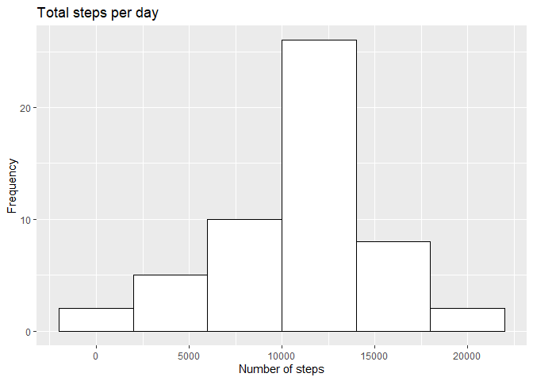
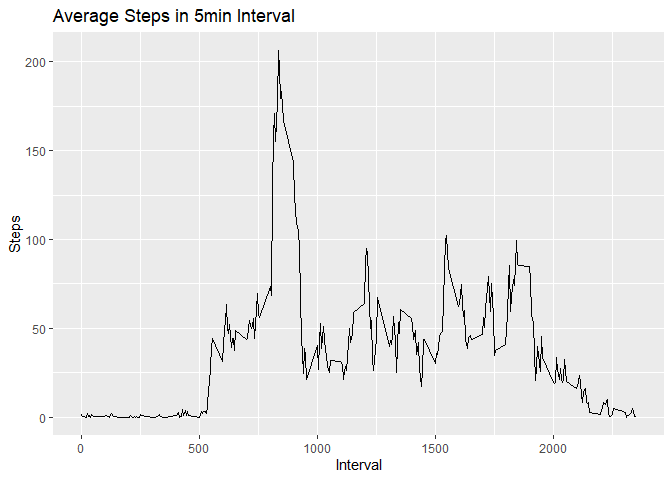
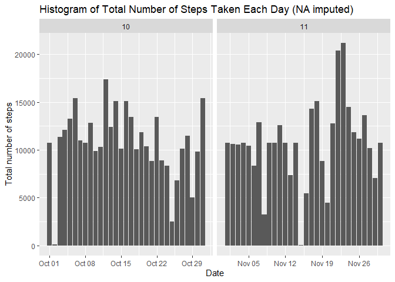
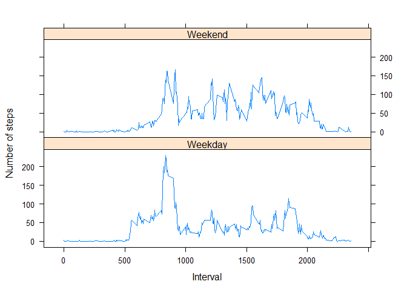

## Loading and preprocessing the data

```r
data <- read.csv(file = "activity.csv",header = TRUE)
data$date <- as.Date(data$date,"%Y-%m-%d")
str(data)
```

```
## 'data.frame':	17568 obs. of  3 variables:
##  $ steps   : int  NA NA NA NA NA NA NA NA NA NA ...
##  $ date    : Date, format: "2012-10-01" "2012-10-01" ...
##  $ interval: int  0 5 10 15 20 25 30 35 40 45 ...
```


## What is mean total number of steps taken per day?

Creating a dataframe to store total steps per day


```r
library(ggplot2)
totalSteps <- aggregate(data$steps,by = list(data$date), FUN = sum)
totalSteps<-totalSteps[complete.cases(totalSteps),]
names(totalSteps) <- c("Date","steps")
head(totalSteps)
```

```
##         Date steps
## 2 2012-10-02   126
## 3 2012-10-03 11352
## 4 2012-10-04 12116
## 5 2012-10-05 13294
## 6 2012-10-06 15420
## 7 2012-10-07 11015
```

Making the plot 

```r
g <- ggplot(totalSteps, aes(steps)) + geom_histogram(binwidth = 4000, fill = "white", color = "black") +labs(title = "Total steps per day", x ="Number of steps", y = "Frequency")
print(g)
```

<!-- -->

Finding mean and median steps per day

```r
meanSteps <- mean(totalSteps$steps, na.rm = TRUE)
medianSteps <- median(totalSteps$steps, na.rm = TRUE)
meanSteps
```

```
## [1] 10766.19
```

```r
medianSteps
```

```
## [1] 10765
```

## What is the average daily activity pattern?

Constructing a dataframe to store mean steps every interval every day

```r
meanStepsInterval <- with(data,aggregate(steps, by = list(interval), FUN=mean, na.rm =T))
names(meanStepsInterval) <- c("Interval","Steps")
head(meanStepsInterval)
```

```
##   Interval     Steps
## 1        0 1.7169811
## 2        5 0.3396226
## 3       10 0.1320755
## 4       15 0.1509434
## 5       20 0.0754717
## 6       25 2.0943396
```

Creating the plot


```r
g <-  ggplot(meanStepsInterval, aes(Interval,Steps)) + geom_line() + ggtitle("Average Steps in 5min Interval")
print(g)
```

<!-- -->

Finding the max value of steps in mean of steps every interval 


```r
maxStepInterval <- meanStepsInterval[which.max(meanStepsInterval$Steps),]
maxStepInterval
```

```
##     Interval    Steps
## 104      835 206.1698
```

## Imputing missing values
Finding missing rows

```r
missingRows <- sum(is.na(data$steps))
missingRows
```

```
## [1] 2304
```

Replacing NA by mean of 5min interval averaged across every day and also rounding it off

```r
processedData <- data
for (i in 1:nrow(processedData)) {
     if (is.na(processedData$steps[i])) {
         processedData$steps[i] <- round(meanStepsInterval[which(processedData$interval[i] == meanStepsInterval$Interval), ]$Steps, digits = 0)
     }
}
head(processedData)
```

```
##   steps       date interval
## 1     2 2012-10-01        0
## 2     0 2012-10-01        5
## 3     0 2012-10-01       10
## 4     0 2012-10-01       15
## 5     0 2012-10-01       20
## 6     2 2012-10-01       25
```

Constructing the plot

```r
library(lubridate)
```

```
## 
## Attaching package: 'lubridate'
```

```
## The following objects are masked from 'package:base':
## 
##     date, intersect, setdiff, union
```

```r
g <- ggplot(processedData, aes(date, steps)) + geom_bar(stat = "identity") + facet_grid(. ~ month(date), scales = "free") + labs(title = "Histogram of Total Number of Steps Taken Each Day (NA imputed)", x = "Date", y = "Total number of steps")
print(g)
```

<!-- -->

Finding mean and median of steps taken everyday using imputed dataset

```r
newTotalSteps <- aggregate(processedData$steps, 
                            list(Date = processedData$date), 
                            FUN = "sum")
names(newTotalSteps) <- c("Date","Steps")

newMean <- mean(newTotalSteps$Steps)
newMedian <- median(newTotalSteps$Steps)
newMean
```

```
## [1] 10765.64
```

```r
newMedian
```

```
## [1] 10762
```

Comparing new mean and median with old values 

```r
meanSteps - newMean
```

```
## [1] 0.549335
```

```r
medianSteps - newMedian
```

```
## [1] 3
```


## Are there differences in activity patterns between weekdays and weekends?
Adding a new column to specify whether date falls on weekend or weekday

```r
processedData <- cbind(processedData,day = weekdays(processedData$date))
processedData$day <- as.character(processedData$day)

processedData[which(processedData$day %in% c("Monday","Tuesday","Wednesday","Thursday","Friday")),]$day <- "Weekday"
processedData[which(processedData$day %in% c("Saturday","Sunday")),]$day <- "Weekend"
processedData$day <- as.factor(processedData$day)
head(processedData)
```

```
##   steps       date interval     day
## 1     2 2012-10-01        0 Weekday
## 2     0 2012-10-01        5 Weekday
## 3     0 2012-10-01       10 Weekday
## 4     0 2012-10-01       15 Weekday
## 5     0 2012-10-01       20 Weekday
## 6     2 2012-10-01       25 Weekday
```

Finding mean of steps on weekdays and weekend

```r
avgSteps <- aggregate(processedData$steps, 
                       list(interval = processedData$interval, 
                            weekdays = processedData$day),
                      FUN = "mean")
names(avgSteps)[3] <- "meanOfSteps"
head(avgSteps)
```

```
##   interval weekdays meanOfSteps
## 1        0  Weekday  2.28888889
## 2        5  Weekday  0.40000000
## 3       10  Weekday  0.15555556
## 4       15  Weekday  0.17777778
## 5       20  Weekday  0.08888889
## 6       25  Weekday  1.57777778
```

Constructing the plot

```r
library(lattice)
xyplot(avgSteps$meanOfSteps ~ avgSteps$interval | avgSteps$weekdays, 
        layout = c(1, 2), type = "l", 
        xlab = "Interval", ylab = "Number of steps")
```

<!-- -->
